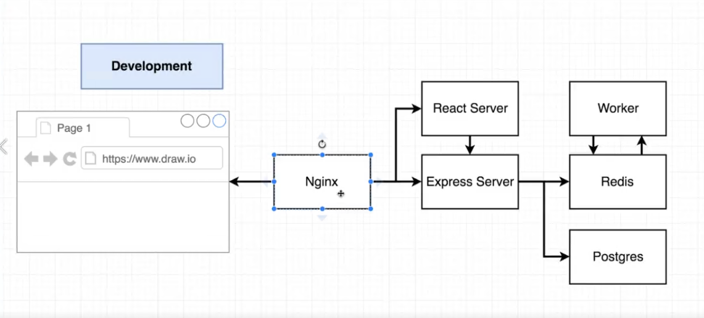
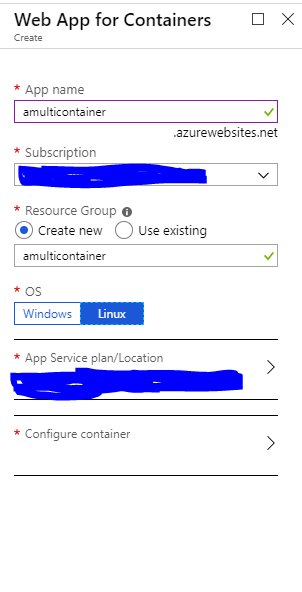
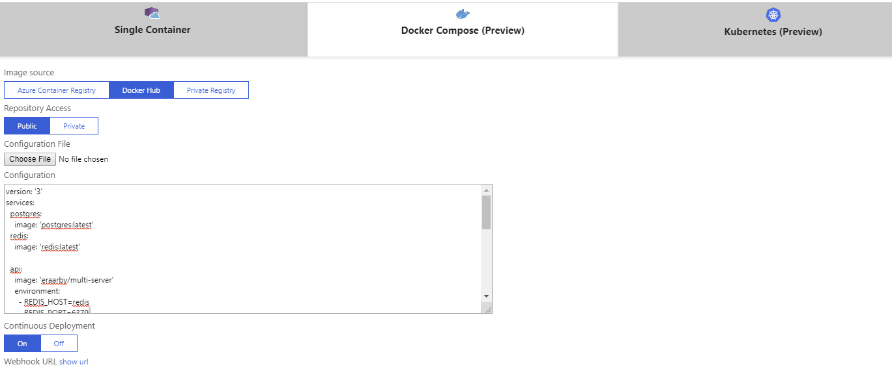

# Multi Container Deployment, using Travis CI and Azure
The application does not have any usable functionality. This only has been used to try the whole development, deployment and CI(Continues Integration)

# Application's Architecture

Application is a React application, which calculate the Fibonacci series. If user input the index of an array, application will calculate the Fibonacci value which should that index contains.
Application has been made, intentionally complex to use multi-container concept for deployment.

## Components
### Worker
Worker is a node js service which will calculate the Fibonacci number and then save the result in a in memory redis container.

### Server
Server is a node js service, which will response to the request from client for submitting an index sending from client. Server will read the calculated value from worker, from redis and saves it into the postgres database.

### Client
Client is a React application which only accept the input of the index from a user and send it to the Server.

### Nginx
Nginx has been used for serving the application and routing purpose. if the user route to /, the Client (React Server), will be served and if the request goes to /api, then Express Server will be served.

## Conatiners which will be created
* redis
* postgres
* worker
* client
* server
* nginx

# How to use the project (For Development)
Clone the repo from 
> `git@github.com:morteza-araby/multi-docker.git`

On your local machine change the directory to the application root folder and run 
> `docker-compose up --build`

This will download and build all images and run the services. At the end of process, you should be able to browse to https://localhost:3443 and use the application.

# How to use the project in Production
We are using Travis CI to build the project and push the images to the docker hub. For this purpose we need to have account in both docker hub and Travis CI.

Create a fork of the application to your account in GitHub. The application will be appeared at your GitHub account.
Go to your Travis CI dashboard and connect your account to GitHub. Travis will show all your repos from GitHub. 
Choose the multi-docker project and activate it using selection button, to allow Travis to watch the commits from GitHub.

At this point, every time we commit a new code to GitHub (master branch), Travis will be triggered and build a new images and push them to Docker hub.

To achieve this, we are using [.travis.yml](.travis.yml) file to handle the build. This file will be picked up by Travis, every time a new commit happens and run thru the command in the file.

# Deployment on Azure
Browse to Azure portal and login with you account. Create a "Web App for Containers". Enter name, and choose Linux as OS.

Choose "Configure container" to configure the container. In this view, choose "Docker Compose (Preview)". Choose "Docker Hub", copy the contente of [docker-compose-az.yml](docker-compose-az.yml) to the configuration section and in "Continuous Deployment" turn it to "on".

